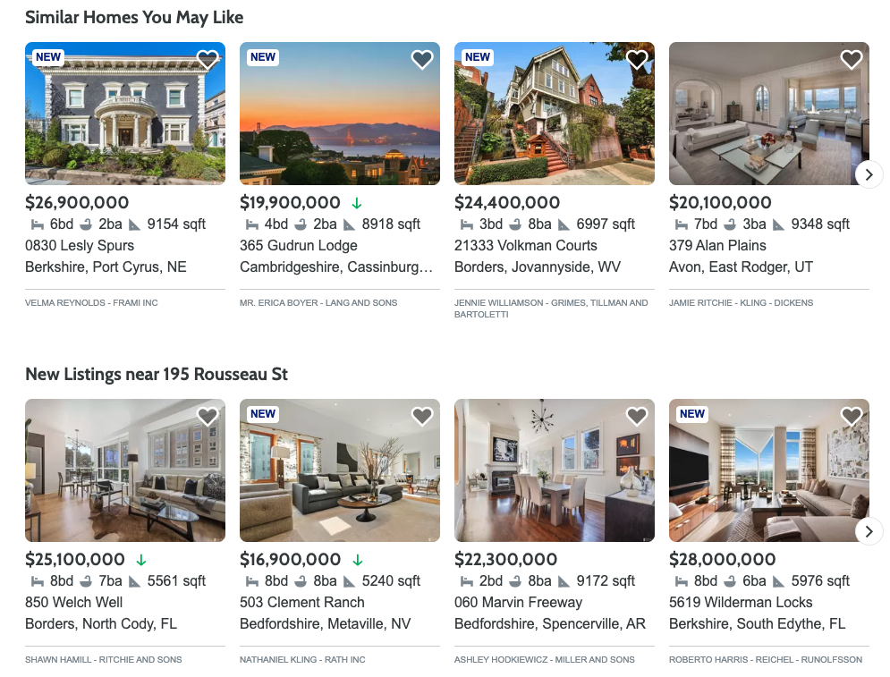

# Project Name

> Similar Homes Photo Carousel

## Related Projects

  - https://github.com/Archon-Design/AffordabilityCalculator
  - https://github.com/Archon-Design/Local-Review
  - https://github.com/Archon-Design/PhotoGallery-rev1
  - https://github.com/Archon-Design/similar-homes-proxy

## Snapshot of Component



## Table of Contents

1. [Usage](#Usage)
1. [Requirements](#requirements)
1. [Development](#development)

## Usage

> Some usage instructions

## Requirements

An `nvmrc` file is included if using [nvm](https://github.com/creationix/nvm).

- Node 6.13.0
- MongoDB v4.4.0

## Development

### Installing Dependencies

From within the root directory:

```sh
npm install : installs packages and dependencies necessary.

npm run build : Will run webpack bundler.

npm run seed : seeds the database.

npm run start : Will start the server and setup the project.

npm run test : runs testing suite and gives a coverage report.
```# similar-homes
